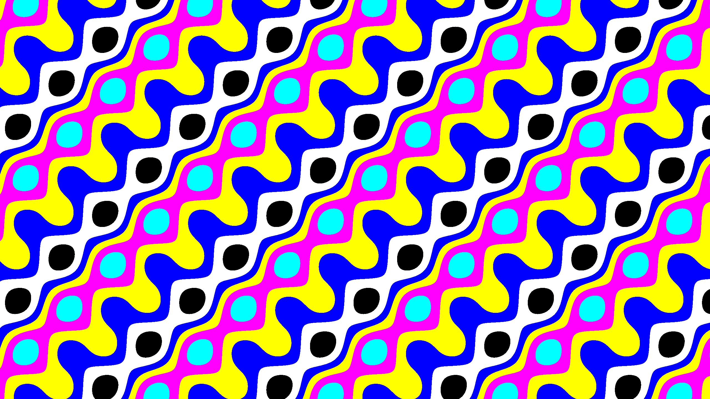
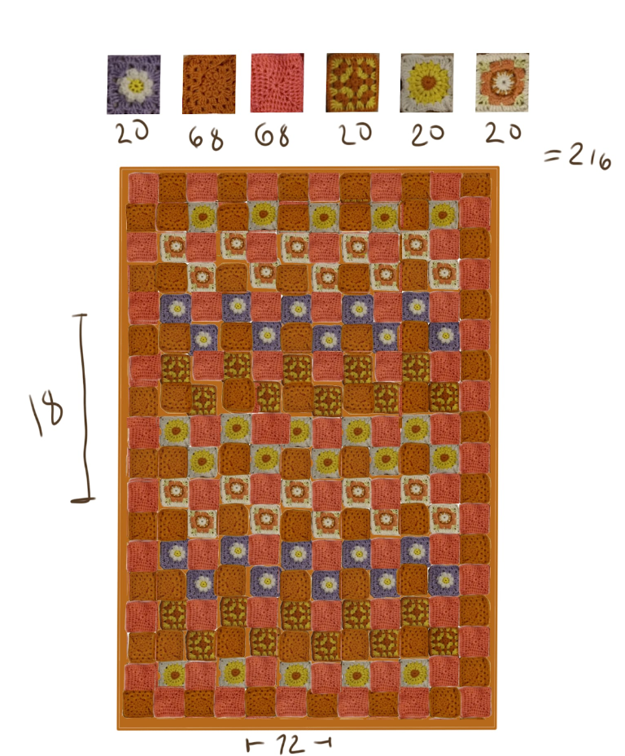
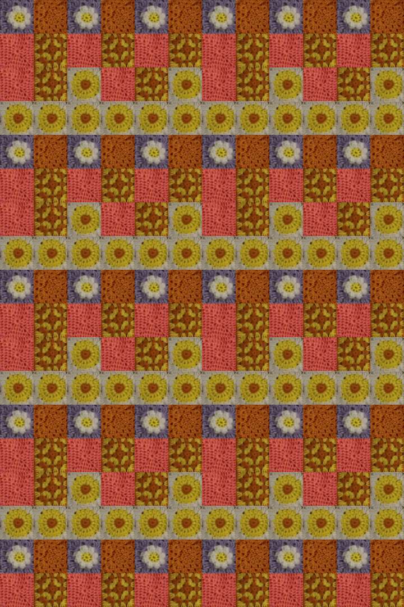

# py-peittogen



**For Anni**

Experimenting on using math with python for various art related use,
generate images based on a mathematical formula. Eventually might be usable for crochet.. maybe.

Includes algorithms for:

- Dragon curve (dragon)
- Sierpinski triangle (sierpinski)
- Voronoi diagram (voronoi)
- L-system (lsystem)
- Sine wave (sinewave)
- Blanket pattern (blanket)

Some pre-generated 2440 x 1440 examples under `examples/` folder.

## Usage

```sh
pip install -r requirements.txt

# main.py [width] [height] [algorithm]
py .\main.py 2560 1440 sierpinski

# blanket accepts additional parameters
# main.py [width] [height] [algorithm] [segments_x] [segments_y]
py .\main.py 720 1080 blanket 12 18
```

## Blanket


In the image is the original hand made draft of a blanket.

Now, with the blanket algorithm, you could generate similar patterns as in the image using the tile system, which can then be used to visualize a blanket for crochet.


This was generated using the algorithm without giving too much thought on the patterns, but it's a good start.
